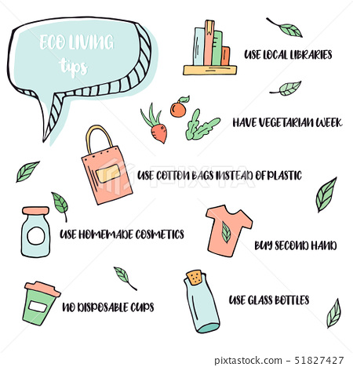
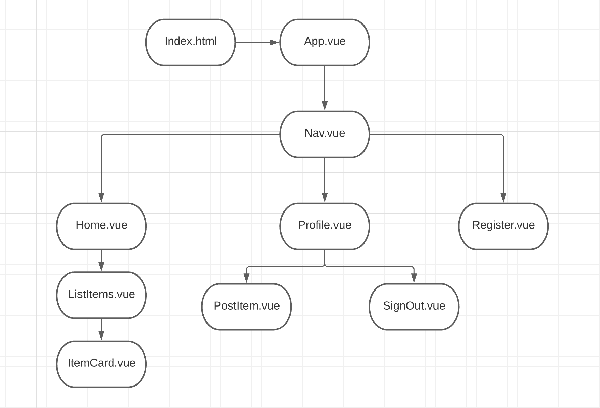
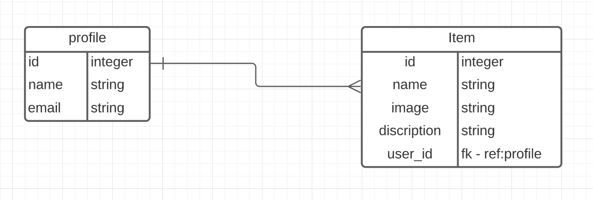

<h1 align="center">ZeroWaste</h1>

## Date: 10/11/2021

### By: Svetlana Shirapova
[Facebook](https://www.facebook.com/) | [GitHub]() | [LinkedIn](https://www.linkedin.com/in/svetlana-shirapova-aa9068219/)

***

### About

Give your stuff the second life. Sell or donate it. Do not waste it.

## Getting Started

A Trello board was used to keep track of development progress and can be viewed [here](https://trello.com/b/eEhnAq85/zerowaste)

## Technology Used

  <h3>Tech Stack</h3>
  &nbsp;&nbsp;&nbsp;&nbsp;&nbsp;&nbsp;&nbsp;&nbsp;&nbsp;&nbsp;&nbsp;&nbsp;&nbsp;&nbsp;&nbsp;&nbsp;

## Screenshots

## Future Updates

## Credits

